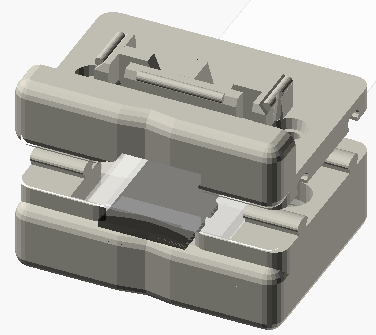

# LC-SD: SD/MicroSD Holder clip for the Mac LC, LC-II, LC-III.

This OpenSCAD design allows attaching an SD of MicroSD extender to the case of a pizza-box Macintosh, without looking too much out-of-place.

## TODO list

- [ ] publish CAD file
